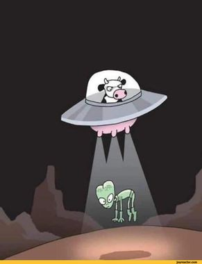

<!--  
-->

#### Michael (misc) Myer

<!-- *====================================* -->

[https://michael105.github.com - *Blog, about me*](https://michael105.github.io)

[https://gist.github.com/ - *github repository index*](https://gist.github.com/8481222f07035e568d774c4d6e0b51ef)

<!-- *====================================* -->

A passionated opensource developer, 
currently preparing a minimal statically linked Linux distribution. 
Currently doing some research on linking,
dependency and package management, containerization.

University graduate, Philosophy and History of Science. (Magister Artium)

Freelancer. 

 

<small>I have not seen a cow,  but only a part which tells
  me a cow is there;   for all the cows I ever saw had hoofs... 
  (M.Porter: Applied Psychology for Nurses)</small>

<!--

**michael105/michael105** is a ✨ _special_ ✨ repository because its `README.md` (this file) appears on your GitHub profile.

Here are some ideas to get you started:

- 🔭 I’m currently working on ...
- 🌱 I’m currently learning ...
- 👯 I’m looking to collaborate on ...
- 🤔 I’m looking for help with ...
- 💬 Ask me about ...
- 📫 How to reach me: ...
- 😄 Pronouns: ...
- ⚡ Fun fact: ...
-->
